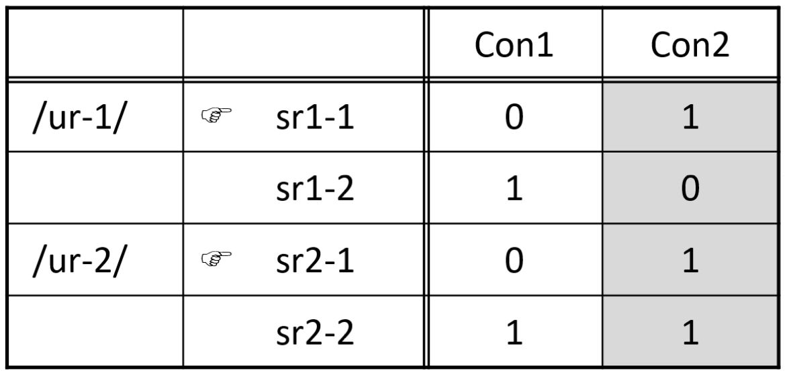
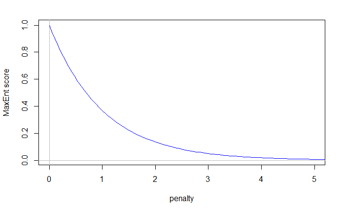
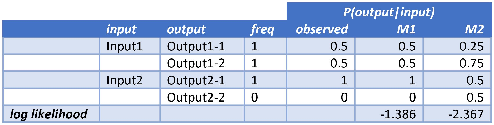
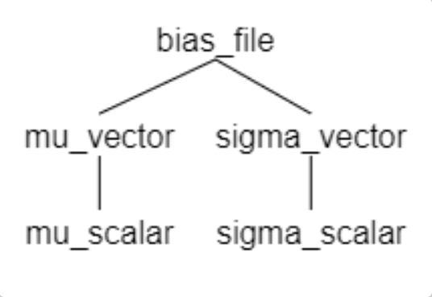

```{r, include = FALSE}
knitr::opts_chunk$set(
  collapse = TRUE,
  comment = "#>",
  warning=FALSE
)
```

```{r setup}
# Import packages
library(maxent.ot)
library(ggplot2)    # For plots
```

# 1 Overview
## 1.1 Why use the Maximum Entropy (MaxEnt) model?
Optimality Theory (OT) (Prince & Smolensky 1993) is one of the leading theories in phonology, and is a very successful model of categorical language data.
In OT, ranked constraints pick a single winning surface representation (SR) for each underlying representation (UR).
Nevertheless, a large proportion of language data is probabilistic. 
Moreover, psycholinguistic experiments (*e.g.* artificial language learning) often produce probabilistic results too.
Thus, multiple models (*e.g.* Stochastic OT (Boersma 1997), Partial Ordering OT (Antilla 1997), Harmonic Grammar (Legendre, Miyata & Smolensky 1990), among others) have been put forward to augment the basic structure of OT, in order to model probabilistic data.
MaxEnt (Goldwater & Johnson 2003) is a one such model. 
In MaxEnt, constraint weights are adjusted in order to maximize the likelihood of data.
One benefit of MaxEnt over other probabilistic models is that the mathematics behind it are well understood and convergence proofs for learning are available (Berger *et al.* 1996).

The `maxent.ot` package implements the MaxEnt model.
There are three functions in this package:

* `optimize_weights()`: Optimizes weights given a data set & optional biases.
* `predict_probabilities()`: Predict probabilities of candidates based on their violation profiles & constraint weights.
* `compare_models()`: Compares two or more model fits to the same data set to determine which provides the best fit, using variety of methods.

## 1.2 OT: A quick recap
We now present a quick recap of OT in order to illustrate how OT and MaxEnt differ in choosing among outputs ([eval]{.smallcaps}) given the same data set (same [con]{.smallcaps} \& [gen]{.smallcaps}).

In OT, ranked constraints choose one winning SR candidate per UR.
Consider the OT tableaux below (*Figure 1*).

```{r, echo=FALSE, fig.cap="Fig 1: Two OT tableaux.", out.width = '40%'}

```

For the UR /ur-1/, Con1 prefers [sr1-1] while Con2 prefers [sr1-2].
Since Con1 outranks Con2, [sr1-1] is the sole winner, and is predicted to be the only SR for this particular UR (*i.e.* a categorical outcome).
By the very same logic, the SR [sr2-1] is the sole realization of the UR /ur-2/ (*i.e.* Con1 prefers [sr2-1] to [sr2-2]).
Notice that Con2 plays no role in deciding the outcome (hence the shading). 

## 1.3 The MaxEnt model defined
In contrast, MaxEnt produces probabilistic outcomes.
In MaxEnt, constraints have weights (rather than being ranked with respect to each other).
The predicted probability of an SR candidate given its UR depends on the weights of the constraints, and is calculated according to the following formula:

$$P(SR_i|UR_i; w) = \frac{1}{Z_w(UR_i)} exp(- \Sigma_{k=1}^mw_k f_k(SR_i, UR_i))$$

where 

* $m$ is the number of constraints
* $w_k$ is the weight of constraint $k$
* $f_k(SR_i, UR_i)$ is the number of violations of constraint $k$ incurred by UR-SR pair <$UR_i, SR_i$>
* $Z_w(UR_i)$ is a normalization term defined as 

$$Z(UR_i) = \Sigma_{SR \in \mathcal{S}(UR_i)} exp(- \Sigma_{k=1}^m w_k f_k(SR, UR_i))$$

where $\mathcal{S}(UR_i)$ is the set of surface realizations of input $UR_i$.


## 1.4 Calculating MaxEnt probabilities: Step-by-step
We'll walk through the MaxEnt tableaux in *Figure 2* to illustrate how the equations in &sect;1.3 are applied to calculate the probability of a particular UR-SR pair.

```{r, echo=FALSE, fig.cap="Fig 2: Two MaxEnt tableaux.", out.width = '85%'}
knitr::include_graphics("../man/figures/maxEnt_tableau_5.jpg")
```

Notice that these two MaxEnt tableaux have the same URs, SRs, constraints, and constraint violation profiles as the two OT tableaux above.
However, instead of being ranked, these constraints now have weights (*e.g.* Con1 weight = 1.6; Con2 weight = 0.8).
There are also four additional columns tagged on to the right of the tableaux, which we use to illustrate how the predicted probabilities are computed.

### 1.4.1 Number of violations, $f_k(SR_i, UR_i)$

An important variable that shows up in the equations above is: $f_k(SR_i, UR_i)$. 
This refers to the number of violations of constraint $k$ incurred by the UR-SR pair, <$UR_i, SR_i$>. 
For example, the UR-SR pair $<$/ur-2/, [sr2-2]$>$ picks up two violations of Con2, so $f_{Con2}(\text{sr2-2}, \text{ur-2}) = 2$ (yellow box).

### 1.4.2 Penalty

Next, we move on to the penalty.
Penalty has also been called "harmony" in other descriptions of the MaxEnt model.
To calculate the penalty for the UR-SR pair <$UR_i, SR_i$>, we take the weighted sum of its constraint violations:
$$\text{penalty for <}UR_i, SR_i\text{> } = \text{ } \Sigma_{k=1}^m w_k f_k(SR_i, UR_i)$$
(Recall that $w_k$ is the weight of constraint $k$, and $m$ is the number of constraints.)

Let's apply this equation to calculate the penalty for the UR-SR pair $<$/ur-2/, [sr2-2]$>$. 
This pair picks up one violation of Con1 and two violations of Con2.
The weighted sum (green box) is thus: 

\begin{align}
\text{penalty for </ur-2/, [sr2-2]>} &= \Sigma_{k=1}^2 w_k f_k(\text{sr2-2, ur-2}) \\
&= weight_{Con1} \times 1 + weight_{Con2} \times 2 \\
&= 1.6 \times 1 + 0.8 \times 2 \\
&= 3.2
\end{align}

The penalties for other UR-SR pairs are similarly calculated.
For example, the penalty for the UR-SR pair $<$/ur-2/, [sr2-1]$>$ is:

\begin{align}
\text{penalty for </ur-2/, [sr2-1]>} &= \Sigma_{k=1}^2 w_k f_k(\text{sr2-1, ur-2}) \\
&=  weight_{Con1} \times 0 + weight_{Con2} \times 1 \\
&= 1.6 \times 0 + 0.8 \times 1 \\
&= 0.8
\end{align}

Notice that $m=2$ because there are two constraints.

### 1.4.3 MaxEnt score

The next column gives the MaxEnt score for each UR-SR pair.
$$\text{MaxEnt score} = exp(-\text{penalty})$$
The Reader may have also encountered this term being called the "potential" in other descriptions of MaxEnt.
Look at the MaxEnt score column of *Figure 2* to see this equation applied.

### 1.4.4 Normalization, $Z$

We then need to normalize the MaxEnt score in order to get probabilities.
The next column provides the $Z$ value for each UR. 
$Z$ is short for Zustandssumme, "sum over states", and has also been known as the normalization constant, or the canonical partition function.
$Z$ is the sum of the MaxEnt scores of all UR-SR pairs arising from a particular UR.

Here's a simplified way to write the equation for the normalization constant of $UR_i$:
$$Z(UR_i) = \Sigma_{j=1}^l m_j$$
where $l$ is the number of UR-SR pairs whose UR is $UR_i$, and $m_j$ is the MaxEnt score of the $j^{th}$ UR-SR pair whose UR is $UR_i$.

Let's apply this equation to calculate the normalization constant for /ur-2/ (blue box):

\begin{align}
Z(\text{ur-2}) &= \Sigma_{i=1}^2m_i \\
&= 0.499 + 0.041  \\
&= 0.490
\end{align}

Here, $l = 2$ because there are only two UR-SR pairs whose UR is /ur-2/.
We basically add the MaxEnt scores of these two pairs to get $Z(\text{ur-2})$.

### 1.4.5 Predicted probability

The predicted probability is shown in the final column.
The probability of a particular SR for a given UR, $UR_i$, is this pair's MaxEnt score divided by the normalization constant associated with $UR_i$:

$$P(SR_i|UR_i) = \frac{\text{MaxEnt score of <}UR_i, SR_i\text{>}}{Z(UR_i)}$$

Let's apply this equation to calculate the probability of [sr2-2] given /ur-2/ (magenta box):

\begin{align}
P(\text{sr2-2}|\text{ur-2}) &= \frac{\text{MaxEnt score of <ur-2, sr2-2>}}{Z(\text{ur-2})} \\
&= \frac{0.449}{0.490} \\
&= 0.083
\end{align}

Congratulations!
You now know how to calculate the probabilities of an SR given its UR when provided with constraint weights.
Next, we'll discuss some characteristics of the probability distribution and of the penalty score.

## 1.5 Characteristics of the MaxEnt model
The probability distribution defined by the first equation above is also known as the Boltzmann distribution or the Gibbs distribution.
Like the Boltzmann distribution, the probability of a particular SR given the UR it arises from is a function of two variables: (1) its penalty and (2) temperature.

**As a particular SR's penalty increases, its probability decreases** (assuming everything else remains unchanged).
The graph below visualizes how a MaxEnt score varies with penalty (*Figure 3*).
Essentially, a higher penalty results in a lower MaxEnt score.
(Note: It is not possible to graph how probability varies with penalty, since the actual probability depends on the penalties of the other SRs arising from the same UR, so we'll use the MaxEnt score as an intermediary.)

``` {r, echo=FALSE, fig.cap="Fig 3: How MaxEnt score varies with penalty.", out.width = '85%'}

```

``` {r, include=FALSE}
# This creates the .jpg image for the graph in the chunk above.
# Ideally, use this (i.e. create graph rather than use an image)...
# ...but this currently renders small plot & ugly big spaces for labels

# Hack to set up window
curve(exp(-x), from=0, to=5,
      col="white", xlab="penalty", ylab="MaxEnt score")    

# Add horizontal & vertical lines at y=0 & x=0
abline(h=0, col="gray")
abline(v=0, col="gray")

# Extend curve to to R-edge of window
curve(exp(-x), from=0, to=5.25, col="blue", add=TRUE)      
```

Recall that the probability of an SR given its UR is directly proportional to its MaxEnt score:

$$P(SR_i|UR_i) \propto M_{UR_i, SR_i}$$

where $M_{UR_i, SR_i}$ is the MaxEnt score of the UR-SR pair <$UR_i, SR_i$>.
We know this because 

$$P(SR_i|UR_i) = M_{UR_i, SR_i} \times \frac{1}{Z(UR_i)}$$

Hence, the relationship between penalty and probability is clear -- a higher penalty results in lower probability (all else remaining unchanged).

The graph also indicates that as penalty increases, the MaxEnt score approaches but never quite reaches 0.
Thus, SR candidates with infinitely high penalties still receive a MaxEnt score greater than zero.
This means that, theoretically, such SRs will receive some probability.
Nevertheless, the probabilities that such SRs receive will be so tiny that they can be treated as not occurring. 
This is useful when using MaxEnt to model a data set that has a mix of categorical and probabilistic phenomena.
For categorical phenomena, the predicted probability that is returned will often be something like: 99.998% SR1, 0.002% SR2.
Such outcomes can be treated as essentially categorical, so **MaxEnt is also capable of modeling categorical data** despite being a probabilistic model.

Temperature is rarely used when modeling linguistic data, so the current simplified formula we've introduced above will do for now. 
We will introduce the final formulation of the probability distribution in &sect;5 when we discuss the `temperature` argument of the `predict_probabilities()` function. It turns out that temperature can be a useful tool in **adjusting model fit to particular psycholinguistic tasks**.

An additional feature of the MaxEnt model arises from how the penalty score is calculated.
Because each violation contributes to the penalty score, multiple violations of a lower-weighted constraint can work together to make an SR less probable than another SR that has only one violation of a higher-wighted constraint.
This phenomenon is called the **"gang-up" effect**.
This effect has been observed in phonological phenomena, and has also been reported experimentally (Breiss 2020). 


# 2 Fitting the model (basic): `optimize_weights()`
## 2.1 Preparing the data file
Let's imagine we have a data set with multiple tableaux, and would like to find constraint weights that maximize the likelihood of our data. 
In order to do that, we first need to know how to structure our data set.
Take a look at the data set below, loaded from the `sample_data_file` data set included in this package. 

```{r}
# Get paths to sample data file
data_file <- system.file(
)

# Take a look at the structure of the sample data
read.table(data_file, header=FALSE, sep='\t')
```

This data set has two tableaux: one for Input1 and another for Input2. 
There are two constraints: Constraint1 & Constraint2.
The columns are organized as follows:

* Column 1: Input (underlying representation)
* Column 2: Output (surface representation)
* Column 3: Frequency
  + Both token counts & relative frequency can be used for the function `optimize_weights`.
  + Token counts are recommended if the User intends to use the function `compare_models` down the line to compare multiple trained models. In particular, relative frequency won't work with the `aic_c` & `bic` methods of `compare_models`.
* Column 4 onwards: Constraints
  + Each constraint takes up one column. 

The first & second rows are only used for Column 4 onwards (*i.e.* constraints).
Full constraint names are in the first row, while their shortened names are in the second. 
Tableaux are inserted from the third row onwards.

The data set is a tab-delimited `.txt` file.
The Reader may notice that the input file is in fact prepared in an OTSoft-style format (Hayes, Tesar & Zuraw 2003).

## 2.2 Finding weights to fit the model: No bias
Now that we've familiarized ourselves with our data set, let's find a set of constraint weights that maximizes the likelihood of the data.

Using the function `optimize_weights()`, we'll train a model for the data set above, and store the result (our trained model) in the object `simple_model`:
```{r dataForSimpleCase}
# Fit weights to data
simple_model <- optimize_weights(data_file)
```

Let's take a closer look at our object `simple_model`:
``` {r}
# View the model we've fit (no biases used)
simple_model
```

The object `simple_model` has 4 relevant named attributes:

  * `weights`: the trained weights for each constraint. This is a named list.
  * `loglik`: the log likelihood of the data under the trained weights
  * `k`: the number of constraints
  * `n`: the number of data points in the training set

## 2.2.1 Retrieving specific model attributes 
We can retrieve any specific model attribute that we'd like.   
For example, if we'd like to see only the learned constraint weights for `simple_model`, we can pull them up as follows:
```{r simpleModelWeight}
# Get learned weights of model we've fit (no biases used)
simple_model$weights
```

Here we see that the trained model happened to learn the same weight (14.2) for both Constraint1 and Constraint2.

Likewise, we can retrieve any other model attribute. For example, here's the log likelihood:

```{r simpleModelLL}
# Get log likelihood of model we've fit (no biases used)
simple_model$loglik
```

This log likelihood is, in fact, at ceiling (at the maximum possible likelihood), which is indicative of overfitting.
The issue of overfitting and the introduction of priors to reduce overfitting will be taken up in &sect;3.3.
But first, let's gain a better understanding of how log likelihood guides training.


## 2.3 Fitting the model to data: Explained
The `optimize_weights()` function implements a learner that adjusts constraint weights in order to fit the model.
The learner's objective is to maximize the value of the objective function, and weight adjustments are made with this objective in mind.
The objective function, $O(w)$, is composed of two terms:

$$O(w) = LL_w(D) - B(w)$$

where $LL_w(D)$ is the log likelihood of training data $D$ under weights $w$, and $B(w)$ is the price to pay for choosing the particular vector of weights $w$.

The first term, $LL_w(D)$, is a measure of model fit to data.
Models that more closely match the observed distribution have a higher $LL_w(D)$ than those with poorer matches.
$LL_w(D)$ ranges between negative infinity and zero.

The second term, $B(w)$, is used when we want to nudge the model towards particular preferred weights (*e.g.* when using biases or priors).
Models with weights that are closer to the preferred ones pay a smaller price (smaller $B(w)$) than those with more aberrant weights.
$B(w)$ ranges between zero and positive infinity.

Higher values of $LL_w(D)$ and lower values of $B(w)$ both contribute to increasing the value of the objective function $O(w)$.
Recall that the learner's objective is to arrive at as high a value of $O(w)$ as possible (it seeks to maximize the value of $O(w)$).
In other words, the learner adjusts weights towards weight values that: 

(1) improve the model's match to the observed distribution: increase $LL_w(D)$
(2) move weights closer to the preferred weight values: decrease $B(w)$

In the rest of this section, we discuss the log likelihood of data, $LL_w(D)$, in greater depth.
We leave the discussion of $B(w)$ to &sect;3, where priors are introduced.


### 2.3.1 Defining log likelihood
When no priors are used, maximizing the objective function $O(w)$ is equivalent to maximizing the log likelihood of training data $LL_w(D)$ alone.
The log likelihood of the training data is:

$$LL_w(D) = \Sigma_{i=1}^n ln P(y_i|x_i; w)$$

Let's unpack the terms of this equation. On the left-hand side, we have $LL_w(D)$, where

* $LL_w(D)$ is the log likelihood of the training data $D$ under weights $w$
* $D$ is the training data
* $w$ is the vector of constraint weights

On the right-hand side:

* $n$ is the number of observed data points
  + *i.e.* the sum of the frequency column in the input
* $y_i$ is the observed surface form of the $i^{th}$ data point, and $x_i$ is the input form that $y_i$ arose from
* $P(y_i|x_i; w)$ is the probability of realizing underlying $x_i$ as surface $y_i$ under the weights $w$

Notice how the value of each of the elements of $w$ (*i.e.* the weight of each individual constraint) is the only variable available for the model to adjust. 


### 2.3.2  What guides the weight changes?: Maximizing log likelihood
Recall that the learner takes in a distribution over training examples, $D$.
For the data set we've been using, $D$ is: $<$Input1, Output1-1$>$: 1, $<$Input1, Output1-2$>$: 1, $<$Input2, Output2-1$>$: 1.  
$<$Input2, Output2-2$>$ is not part of $D$ because it isn't observed.

The learner's goal is to maximize the log likelihood of $D$.
In other words, the learner seeks to produce a distribution over these three training examples that matches the observed distribution as closely as possible. 
The learner adjusts the weights with this goal in mind.

```{r, echo=FALSE, fig.cap="Table 1: Log likelihood of data under weights of M1 & M2.", out.width = '85%'}

```

<!-- |Input|Output|Freq|Observed P(Output\|Input)|M1|M2| -->
<!-- |:---|---|---:|---:|---:|---:| -->
<!-- |Input1|Output1-1|1|.5|.5|.25| -->
<!-- ||Output1-2|1|.5|.5|.75| -->
<!-- |Input2|Output2-1|1|1|1|.5| -->
<!-- ||Output2-2|0|0|0|.5| -->
<!-- |logLike||||-1.386|-2.367| -->

Let's imagine we have two models, *M1* & *M2*, whose weights (whatever they may be) produce the predicted distributions P(output|input) shown in the final two columns of *Table 1*.
For ease of comparison, the observed relative frequencies are shown in the third-to-last column.
Right away, we can see that *M1* matches the observed distribution much better than *M2* does.
In other words, the observed data are more likely to occur under the weights of *M1* than they are to occur under the weights of *M2*.
Though we haven't yet applied the equation above to calculate the log likelihood of the data under the weights of these two models, we can expect that *M1* will produce a higher log likelihood than *M2*.

Now we'll apply the log likelihood equation to calculate the log likelihood of the data under the weights of *M1* \& *M2*. 
Log likelihoods may range from negative infinity to 0, with higher log likelihoods indicating that a model's weights produce a better fit to the observed data.
Here's the log likelihood equation again:

$$LL_w(D) = \Sigma_{i=1}^n ln P(y_i|x_i; w)$$

Applying the equation to *M1* ($w_{M1}$ refers to *M1*'s weights): 
\begin{align}
LL_{w_{M1}}(D) &= \Sigma_{i=1}^3 ln P(y_i|x_i; w) \\
&= ln(.5) + ln(.5) + ln(1) \\
&= -1.386
\end{align}

Applying the equation to *M2* ($w_{M2}$ refers to *M2*'s weights): 
\begin{align}
LL_{{w_{M2}}}(D) &= \Sigma_{i=1}^3 ln P(y_i|x_i; w) \\
&= ln(.25) + ln(.75) + ln(1) \\
&= -2.367
\end{align}

The log likelihood of the observed data, $D$, is higher under the weights of *M1* than it is under the weights of *M2*.
This is because *M1*'s weights produce a predicted distribution over observed UR-SR pairs that is closer to the observed distribution than *M2*'s weights do.
(Notice that only observed data are included in the calculations above.
Despite Output2-2 getting 50\% of the predicted probability in *M2*, it does not contribute to the log likelihood.)

Hence, aiming to maximize the log likelihood of training data results in finding weights that produce a predicted distribution that is as close to the observed one as possible.
For example, we can imagine the learner starting with the weights that produce a distribution that is very distant from that of the observed training data.
With its goal of maximizing the log likelihood of training data, the learner moves to the weights of *M2*, and eventually arrives at the weights of *M1*, where training is halted and *M1*'s weights are the weights of the final trained model.


%%TODO: It's been awkward calling the full formulation of the objective function (which also includes the bias in addition to LL) "log likelihood". Since really only the first term is the log likelihood. Do we want find a more accurate name for the term we're maximizing? Maybe "loss"? Or maybe just "objective function"? I've used the term cost elsewhere to describe the "cost" of picking certain constraint weights that differ from a preferred value if we've decided beforehand that this constraint's weight should be a particular preferred value, so maybe avoid "cost".


### 2.3.3 The learning algorithm
%%TODO: Do we want to explain the learning algo? L-BFGS? Or is this an overkill? Maybe just some light hill-climbing without the L-BFGS (though the package actually implements L-BFGS-B)?

* Probably stuff from second-last para of manual goes here.
* also include upper- and lower-bound info.


# 3 Fitting the model with priors: `optimize_weights()`

Here's the general formula for the objective function, $O(w)$, repeated here for ease of reference:

$$O(w) = LL_w(D) - B(w)$$

In the previous section (&sect;2), we ignored the second term, so objective function, $O(w)$, depended upon only the log likelihood of the training data under the current weights.
In this section, we'll make use of the second term, $B(w)$.
This term is also known by several names such as the "bias term", the "prior", and in special cases, the "regularization term".
The bias term allows us to nudge the learner towards particular weights by introducing an added price to pay for weights that differ from the ones that the User specifies.

Some use cases for the bias term include using the bias term as simple regularization to avoid overfitting (Goldwater & Johnson 2003), and the modeling of proposed phonological learning biases (Wilson 2006, White 2013, Mayer 2021, among others).
Worked examples using the bias term for regularization and for modeling learning biases are provided in &sect;3.3 and &sect;3.4 respectively.

## 3.1 Unpacking the math behind the bias term
Here's the formula for the bias term, which determines the price to be paid for choosing particular constraint weights:

$$B(w) =  \Sigma_{k=1}^m \frac{(w_k - \mu_k)^2}{2\sigma_k^2}$$

* $m$ is the number of constraints
* $w_k$ is the weight of constraint $k$
* $\mu_k$ and $\sigma_k$ parameterize a normal distribution that acts as a prior for the value of $w_k$
  + $\mu_k$: constraint $k$'s ideal weight
  + $\sigma_k$: indicates tolerance for deviation from ideal weight, $\mu_k$

Every constraint, $k$, whose weight $w_k$ differs from $\mu_k$ will thus incur an additional price that needs to be paid.
This price is subtracted from the log likelihood ($LL_w(D)$), and thus makes the objective function, $O(w)$ smaller (notice the negative sign preceding the second term).
Recall that the learner's goal is to maximize the objective function, $O(w)$ (*i.e.* get it as high as possible).
The price to be paid depends upon two factors: (1) Distance from the ideal weight; (2) Tolerance for weight discrepancy.

(1) Price to be paid increases as the distance from the ideal weight increases. 
The distance from the ideal weight is $w_k - \mu_k$. 
For example, let's set the ideal weight for constraint $k$ at 0 ($\mu_k$ = 0). 
A model that gives constraint $k$ a weight of 1.5 will accrue a lower price to pay than one that gives it a weight of 3.5, as the former has a smaller weight discrepancy.
More specifically, the value that is subtracted (*i.e.* price to pay) for constraint $k$ is directly proportional to the square of the weight discrepancy, all else being equal. 
$$ \text{value to be subtracted} \propto (w_k - \mu_k)^2$$

(2) Price to be paid increases as the tolerance for weight variation decreases. 
$\sigma_k$ determines how costly the weight discrepancy is for constraint $k$. 
The smaller $\sigma_k$ is, the lower the tolerance for a particular weight discrepancy.
For example, let's imagine that we set the ideal weight for constraint $k$, at 0 ($\mu_k$ = 0), and that the constraint's actual weight, $w_k$ is 1.5; the weight discrepancy is thus 1.5.
This same weight discrepancy results in a higher price to pay in a model that has $\sigma_k$ = 0.5 (lower tolerance) than in a model that has $\sigma_k$ = 1 (higher tolerance).
More specifically, the value that is subtracted (*i.e.* price to pay) for constraint $k$ is inversely proportional to the square of the tolerance, all else being equal.
$$ \text{value to be subtracted} \propto (\frac{1}{\sigma_k})^2$$

The choice of $\sigma$ depends on the sample size. 
As the number of data points increases, $\sigma$ must decrease in order for the effect of the bias to remain constant.
Specifically, $n\sigma^2$ must be held constant, where $n$ is the number of tokens.


## 3.2 Using the prior: Which argument to use?
There are five arguments that may be used to pass in values for the bias parameters $\mu$ and $\sigma$.
The arguments are: 

* `bias_file`
* `mu_vector`
* `sigma_vector`
* `mu_scalar`
* `sigma_scalar`

To use the argument `bias_file`, pass in a `.txt` file with the structure below.

``` {r}
# Get paths to toy data and bias files.
data_file <- system.file(
  "extdata", "sample_data_file.txt", package = "maxent.ot"
)
bias_file <- system.file(
  "extdata", "sample_bias_file.txt", package = "maxent.ot"
)

# Take a look at the structure of the bias_file
read.table(bias_file, header=FALSE, sep='\t')
```

The bias file is a tab-delimited `.txt` file.
Constraints appear in the rows.
The first column specifies the ideal weight, $\mu$, and the second column specifies the tolerance for weight discrepancy, $\sigma$. 
In the example above, both constraints happen to have the same values for $\mu$.
However, if the User so wishes, they may specify different values of $\mu$ for different constraints. 
The same applies to $\sigma$.
Below, we fit weights with the biases specified in a file.

``` {r}
# Fit weights with biases specified in file
optimize_weights(data_file, bias_file)
```

The arguments `mu_vector` and `sigma_vector` allow us to specify biases in vector form.
This enables us to specify different values of $\mu$ for each constraint, if we so desire.
The same applies to $\sigma$.
Below, we fit weights with the bias parameters specified in vector form.
For each `..._vector` argument, we have to combine the individual parameter values into a vector using the `c()` function (*e.g.* `c(100, 200)`).

``` {r}
# Fit weights with biases specified in vector form
optimize_weights(
  data_file, mu_vector = c(1, 2), sigma_vector = c(100, 200)
)
```

The arguments `mu_scalar` and `sigma_scalar` allow us to specify the bias parameter values just once for all constraints.
This is useful when all constraints share the same ideal weight, $\mu$, or when they all share the same tolerance for weight discrepancy, $\sigma$.
Below, we fit weights with the bias parameters specified in scalar form.

``` {r}
# Fit weights with biases specified as scalars
optimize_weights(
  data_file, mu_scalar = 0, sigma_scalar = 1000
)
```

A mix of scalar and vector biases is also possible: 
``` {r}
# Fit weights with a mix of scalar and vector biases
optimize_weights(
  data_file, mu_vector = c(1, 2), sigma_scalar = 1000
)
```

Any combination of arguments can be used to specify the bias parameters.
The User, however, is advised that when multiple values are specified for the same parameter, the algorithm decides which one to use according to the chart in *Figure 4*.

```{r, echo=FALSE, fig.cap="Fig 4: Hierarchy for choosing which bias parameters to use when conflicts arise. Parent over-writes child.", out.width = '25%'}

```

In this chart, the argument above takes precedence over the one(s) it dominates.
For example, if the User passes in both a file for `bias_file` and a separate value for `mu_scalar`, the parameter values specified in `bias_file` will be used and the one specified in `mu_scalar` will be ignored. 
Likewise, if the User passes in both a vector for `sigma_vector` and another value for `sigma_scalar`, the vector for `sigma_vector` will be used and the value for `sigma_scalar` will be ignored.

If only one of the two bias parameters is present, an error will be raised.
(*e.g.* When values are provided for $\mu$, but there are none for $\sigma$.)


## 3.3 Overfitting & regularization
### 3.3.1 Ceiling log likelihood
In &sect;2.2 we noted that the log likelihood attained by `simple_model` was in fact at ceiling.
``` {r}
# Get log likelihood of simple model
simple_model$loglik
```

Each data set has a theoretical maximum log likelihood, which can be calculated.
Recall that the data set had 3 data points (*i.e.* observed outputs). 
(Frequency shows up in the third column.)

``` {r}
# View the data that was used to train `simple_model`
read.table(data_file, header=FALSE, sep='\t')
```

* For Input1, there were 2 outputs, each of which surfaced once. 
  + Observed $P(\text{Output1-1}|\text{Input1}) = 0.5$
  + Observed $P(\text{Output1-2}|\text{Input1}) = 0.5$
* For Input2, 1 output surfaced once. 
  + Observed $P(\text{Output2-1}|\text{Input2}) = 1$

Let's calculate the theoretical ceiling log likelihood.
Here's the equation for log likelihood of training data, repeated for easy reference:

$$LL_w(D) = \Sigma_{i=1}^n ln P(y_i|x_i; w)$$

A trained model that matches the observed distribution perfectly would have attained the ceiling log likelihood.
We'll imagine just such a perfect trained model that matches the observed distribution perfectly, and calculate its log likelihood of training data: 
\begin{align}
LL_w(D) &= \Sigma_{i=1}^3 ln P(y_i|x_i; w)\\
&= ln(.5) + ln(.5) + ln(1) \\
&= -1.386
\end{align}

Since the log likelihood of training data attained by our perfect trained model matches that of `simple_model`, we conclude that `simple_model` also attained the ceiling log likelihood.
In other words, the distribution produced by `simple_model`'s weights matches the distribution of the training data perfectly.

### 3.3.2 Regularization as a strategy to combat overfitting
Trained models that fit the training data too well often cannot generalize to unseen data.
Such models are said to **overfit** the training data.
One strategy to reduce overfitting is to include a regularization term. 
The intended effect of regularization is to keep the weights as low as possible. 

To put this into practice, we'll make use of the optional arguments `mu_scalar` & `sigma_scalar` of the function `optimize_weights()`.
To keep weights low, we'll set `mu_scalar = 0` & `sigma_scalar = 1`.
This means that we believe that every constraint should:

  * Have an ideal weight = 0
  * Have standard deviation = 1

Since every constraint has the same ideal weight & the same standard deviation (tolerance for weight discrepancy), we can make use of the optional arguments `mu_scalar` & `sigma_scalar` to input $\mu$ and $\sigma$ just once for all constraints.
```{r scalarBiases}
# Train regularized model with mu_scalar=0 & sigma_scalar=1
regularized_model <- optimize_weights(
  data_file, mu_scalar=0, sigma_scalar=1
)
```

Inspecting the trained regularized model, we now see a value for the attribute `bias_params`:
```{r}
# Take a took at the regularized model trained with scalar biases
regularized_model
```

We can retrieve this attribute alone:
```{r}
# View the bias parameters we used during model training
regularized_model$bias_params
```

Constraints are ordered in rows.
The first column gives the $\mu$ and the second column the $\sigma$ for the constraint in question.

Let's take a look at the trained weights for the regularized model:
```{r biasModelAttributes}
# Get learned weights for the regularized model trained with scalar biases
regularized_model$weights
```
The trained regularized model has learned that Constraint 1 has weight = 0.105, and Constraint 2 has weight = 0.316.
Notice that the weights for both constraints are now closer to 0 (*cf.* the unbiased model where trained weights for both constraints were 14.2).
We attained this by including a prior term that tagged on a price to pay for weights whose value did not exactly match the ideal weight.
In particular the price to be paid increased the further a constraint's weight was from the ideal weight $0$.

Notice also that the log likelihood of the regularized model is below ceiling ($-2.000 < -1.386$).

```{r biasModelLoglik}
# Get log likelihood of model trained with scalar biases
regularized_model$loglik
```

**Retrieving the weight of 1 constraint**

Let's imagine that we're only interested in a tracking the weight of a subset of the constraints.
For example, we're interested only in Constraint 1, and want to track the weight learned for this constraint in the unbiased and the simple bias (regularized) model.
We use index `1` to pick out the first constraint from the named list `your_model_name$weights`.
Similarly, if we were interested in the second constraint, we'd use index `2`, and so on.
```{r}
# Get weight of Constraint 1 (simple model)
cons1_noBias <- simple_model$weights[1]

# Get weight of Constraint 1 (regularized model)
cons1_simpleBias <- regularized_model$weights[1]

# Compare learned weights of Constraint 1 in the unbiased model...
# ...and in the regularized one
print(paste("In the unbiased model, Constraint 1's  weight is:", 
            sprintf(cons1_noBias, fmt = '%#.3f')))
print(paste("In the regularized model, Constraint 1's  weight is:", 
            sprintf(cons1_simpleBias, fmt = '%#.3f')))
```

## 3.4 Incorporating substantive effects

Another reason to make use of the prior term is to model substantive effects.
We can set different preferred weights ($\mu$) for different constraints, by setting different tolerances for deviation from the preferred weight ($\sigma$), or by using a combination of the two.

We'll walk through a simplified version of White (2017), in which substantive effects were used to model psycholinguistic results.


### 3.4.1 The phenomenon: Productivity of saltation (White 2017)

Consider the following artificial grammar learning experiment (White 2017).
Participants were trained on either a p&rarr;v alternation (experimental condition) or a b&rarr;v alternation (control condition).
During the response phase, participants were tested on two alternations.
In the first, they were tested on producing the alternation they were trained on ("test"). 
In the second, they were tested on extending the alternation to the other unseen pair ("extension"). 
That is, for those trained on the p&rarr;v alternation, the b&rarr;v alternation was considered the "untrained alternation/extension", and vice versa.

**Experimental result to be modeled:** 

Extension to untrained sounds occurred more frequently in the experimental condition (trained on p&rarr;v; extended to b&rarr;v) at 73% than in the control condition (trained on b&rarr;v; extended to p&rarr;v) at 20%. The percentage alternation by participants in the response phase is shown below. 

```{r echo=FALSE}
# Create matrix with 3 columns
tab <- matrix(c(95, 90, 73, 20), ncol=2, byrow=TRUE)

# Define column names and row names of matrix
colnames(tab) <- c('Expt cdn', 'Control cdn')
rownames(tab) <- c('trained', 'untrained')

# Convert matrix to table 
tab <- as.table(tab)

# View table 
tab
```

Given that the perceptual distance between [b] & [v] is smaller than that between [p] & [v], substantive effects arising from perceptual distance appear to play an important role.

### 3.4.2 Modeling the extension of p&rarr;v (trained) to b&rarr;v (untrained)

So how can we introduce these substantive factors into the model?
Intuitively, we want to make it more difficult to map [p] to [v] than it is to map [b] to [v].
We will use *Map(x,y) constraints (Zuraw 2007, 2013), which prohibit the mapping between sound x and sound y.
We give \*Map(p,v) a higher preferred weight than \*Map(b,v), which means that the mapping from [p] to [v] is more strongly prohibited than the mapping from [b] to [v].
Following White, we'll set $\mu$'s of these constraints to the following preferred weights:

* $\mu$ of \*Map(b,v) = 1.3
* $\mu$ of \*Map(p,v) = 3.65

Markedness constraints \*V[-cont]V and \*V[-voi]V drive the alternation from stops to [v] intervocally. 
These have a preferred weight of 0 to reflect that intervocalic stops and voiceless sounds were allowed in the participants' native languages. 

The training data for the experimental condition includes only the p&rarr;v alternation, reflecting the training phase encountered by the subjects in the experimental condition:

```{r}
# Get path to data file (experimental condition)
white_salt_data_file <- system.file(
  "extdata", "sample_whiteSalt_data_file.txt", package = "maxent.ot"
)

# View training data (experimental condition)
read.table(white_salt_data_file, header=FALSE, sep='\t')
```

We now train the bias model for the experimental condition, making use of the argument `mu_vector`.
We want the value of $\mu$ to be 0, 0, 1.3 and 3.65 for the four ordered constraints [\*V[-cont]V, \*V[-voi]V, \*Map(b,v), \*Map(p,v)] respectively.
We have to combine these four values into a vector using the `c()` function (*i.e.* `c(0, 0, 1.3, 3.65)`).
Here, we choose to have the same tolerance for deviation from the preferred weight for all constraints, so we'll use the argument `sigma_scalar`.

```{r}
# Fit model with preferred weights for experimental condition
white_salt_bias_model = optimize_weights(
  white_salt_data_file, mu_vector=c(0, 0, 1.3, 3.65), sigma_scalar=sqrt(0.6)
)

# View trained weights (expt cdn with bias)
white_salt_bias_model$weights
```

Now let's train an unbiased model for the same experimental condition. 
We'll average out the preferred weights for the two *Map constraints, which results in each of these constraint having preferred weight = 2.27.

```{r}
# Fit unbiased model for experimental condition
white_salt_noBias_model = optimize_weights(
  white_salt_data_file, 
  mu_vector=c(0, 0, 2.27, 2.27), sigma_scalar=sqrt(0.6)
)

# View trained weights (expt cdn, no bias)
white_salt_noBias_model$weights
```

At this point, we've essentially trained the model on only the p&rarr;v alternation.
Next, we'll see how well our trained models perform on both the test task (p&rarr;v) as well as on the extension task (b&rarr;v). 
Notice how both these phases (training and response) reflect the experimental setup with human subjects.

We'll need a new test file that includes the observed frequencies for both the test (p&rarr;v) and extension (b&rarr;v) alternations.
We'll pass both the models trained above as well as the new test file to the function `predict_probabilities()`.
We'll take a closer look at both the function `predict_probabilities()`, and the structure of the test file when we introduce `predict_probabilities()` in &sect;4 below.
For now, we'll just focus our attention on the predicted probability calculated by this function.

```{r}
# Get path to test file (experimental condition)
white_salt_test_file <- system.file(
  "extdata", "sample_whiteSalt_test_file.txt", package = "maxent.ot"
)

# View test data (experimental condition)
read.table(white_salt_test_file, header=FALSE, sep='\t')

# Predict probabilities with weights trained with bias (expt cdn)
predict_probabilities(
  white_salt_test_file, white_salt_bias_model$weights
)

# Predict probabilities with weights trained without bias (expt cdn)
predict_probabilities(
  white_salt_test_file, white_salt_noBias_model$weights
)
```

For ease of reference, the predicted percentage of alternation for the trained biased and unbiased models are summarized in the table below:

```{r echo=FALSE}
# Create matrix with 3 columns
tab <- matrix(c(91, 93, 78, 45), ncol=2, byrow=TRUE)

# Define column names and row names of matrix
colnames(tab) <- c('Biased model', 'Unbiased model')
rownames(tab) <- c('Trained (95%)', 'Untrained (73%)')

# Convert matrix to table 
tab <- as.table(tab)

# View table 
print("Predicted % of alternation during response phase (experimental condition)")
tab
```

Recall that during the response phase, participants performed the following two alternations at the following rates:

  * [p] &rarr; [v] (trained "test"): 95% 
  * [b] &rarr; [v] (untrained "extension"): 73% 

Overall, the biased model provided a better fit to the observed data. 
Predicted probability differed by no more than 5.5%, with the greatest discrepancy showing up for the untrained [b] &rarr; [v] alternation.

The unbiased model, in contrast, performed  poorly.
In particular, the untrained [b] &rarr; [v] alternation appeared to be close to chance (45%). 

### 3.4.3 Modeling the extension of b&rarr;v (trained) to p&rarr;v (untrained)

Let's now train a biased and an unbiased model for the control condition. 
The training data includes only the b&rarr;v alternation, reflecting the training phase of the control condition:

```{r}
# Get path to data file (control condition)
white_control_data_file <- system.file(
  "extdata", "sample_whiteCtrl_data_file.txt", package = "maxent.ot"
)

# View training data (control condition)
read.table(white_control_data_file, header=FALSE, sep='\t')

# Fit model with preferred weights for control condition
white_control_bias_model = optimize_weights(
  white_control_data_file,
  mu_vector=c(0, 0, 1.3, 3.65), sigma_scalar=sqrt(0.6)
)

# View trained weights (control cdn with bias)
white_control_bias_model$weights

# Fit unbiased model for control condition
white_control_noBias_model = optimize_weights(
  white_control_data_file,
  mu_vector=c(0, 0, 2.27, 2.27), sigma_scalar=sqrt(0.6)
)

# View trained weights (control cdn, no bias)
white_control_noBias_model$weights
```

As with the experimental condition above, we'll now subject the two trained models to the response phase, which includes the test (b&rarr;v) and extension (p&rarr;v) tasks.

```{r}
# Get path to test file (control condition)
white_control_test_file <- system.file(
  "extdata", "sample_whiteCtrl_test_file.txt", package = "maxent.ot"
)

# View test data (control condition)
read.table(white_control_test_file, header=FALSE, sep='\t')

# Predict probabilities with weights trained with bias (control cdn)
predict_probabilities(
  white_control_test_file, white_control_bias_model$weights
)

# Predict probabilities with weights trained with bias (control cdn)
predict_probabilities(
  white_control_test_file, white_control_noBias_model$weights
)
```

For ease of reference, the predicted percentage of alternation for the trained biased and unbiased models are presented in the table below:

```{r echo=FALSE}
# Create matrix with 3 columns
tab <- matrix(c(87, 87, 26, 61), ncol=2, byrow=TRUE)

# Define column names and row names of matrix
colnames(tab) <- c('Biased model', 'Unbiased model')
rownames(tab) <- c('Trained (90%)', 'Untrained (20%)')

# Convert matrix to table 
tab <- as.table(tab)

# View table 
print("Predicted % of alternation during response phase (control condition)")
tab
```

During the testing phase, participants performed the following two alternations at the following rates:

  * [b] &rarr; [v] (trained "test"): 90% 
  * [p] &rarr; [v] (untrained "extension"): 20%
  
The biased model matches the observed data relatively well.
The unbiased model, in contrast, greatly overgeneralizes to the untrained p&rarr;v alternation.

### 3.4.4 Conclusion 
Overall, the biased model, which incorporated substantive biases, performed much better than the unbiased one (no substantive influences) at modeling human subject responses during the response phase.
The unbiased model both greatly underpredicted extension to the b&rarr;v alternation in the experimental condition and greatly overpredicted the extension to the p&rarr;v alternation in the control condition.
In contrast, the biased model neither vastly under- nor overpredicted on any of the response tasks.

For the biased model, we introduced different preferred weights for separate constraints by utilizing the `mu_vector` argument of the `optimize_weights()` function.
These preferred weights were chosen to represent the substantive effects that arose from perceptual distances.
The resulting trained biased model was able to match the observed frequencies of alternations produced by human subjects during the response phase much more closely than its unbiased counterpart in all experimental conditions, thus demonstrating the utility of incorporating substantive biases for linguistic modeling. 


# 4 Making predictions: `predict_probabilities()`
The function `predict_probabilities()` predicts the probabilities of SR candidates based on their violation profiles and the constraint weights.

The function `predict_probabilities()` requires at the very least, the following two arguments:

(1) An input file identical to the one for `optimize_weights()`
(2) Constraint weights

## 4.1 Get predictions with trained weights
Let's imagine that we want to make a prediction using the weights of a model that we've trained using `optimize_weights()`.
If we've trained a model using `optimize_weights()` and stored the trained model in the object `fit_model`, we can specify the constraint weights by passing in the `weights` attribute of the model: `fit_model$weights`. 

``` {r}
# Get paths to toy data file 
data_file_a <- system.file(
  "extdata", "sample_data_file.txt", package="maxent.ot"
)

# Fit weights to data (no biases)
fit_model_a <- optimize_weights(data_file_a)

# Predict probabilities for the same input 
predict_probabilities(data_file_a, fit_model_a$weights)
```

The structure of the returned object is as follows:

* The first $n$ columns are essentially identical to the input file, where $n$ is the number of columns in the input file
* Third-from-last column: Predicted probability
* Second-from-last column: Observed probability
* Last column: Error
  + *error~i~* = *predicted probability~i~* - *observed probability~i~*, where *i* is a row
  + Positive value: overprediction
  + Negative value: underprediction

**A point of caution: Duplicate UR entries**

When there are multiple instances of the same UR, both `Predicted Probability` and `Observed Probability` are normalized over all instances of the UR.
However, `Error` is still computed row-wise.
This leads to issues with the interpretation of `Error`.

Duplicate UR entries may arise when modeling experimental data.
For example, we'll imagine that our experiment had two unique URs: *Input1* and *Input2*.
The first participant picked *Output1-1* for *Input1* and *Output2-1* for *Input2*.
The second participant picked *Output1-2* for *Input1* and failed to respond for *Input2*.
We thus get the frequencies below (data_file_b).

``` {r}
# Data has repeated URs (absolute frequency)
# Get paths to toy data file
data_file_b <- system.file(
  "extdata", "sample_data_file_double_aFreq.txt", package="maxent.ot"
)

# Take a look at the structure of the sample data with duplicate URs
read.table(data_file_b, header=FALSE, sep='\t')

# Here's the structure of the same data without duplicate URs
read.table(data_file_a, header=FALSE, sep='\t')
```

Notice that both `data_file_a` and `data_file_b` describe the same data, albeit in a different manner.
If we'd collapsed all instances of repeated URs from `data_file_b`, we'd the get `data_file_a`.
However, the resulting `Error` from both data sets differ.

``` {r}
# Fit weights to data (no biases)
fit_model_b <- optimize_weights(data_file_b)

# Predict probabilities for the same input (duplicate URs)
predict_probabilities(data_file_b, fit_model_b$weights)
```

Interpreting the `Error` for `data_file_a` is straightforward, while the `Error` for `data_file_b` is uninterpretable.
(*e.g.* Regarding `data_file_b`, what does it mean when the the first instance of *Output1-2* has a 25% overprediction error?)

For this reason, it is strongly recommended to check one's data set for duplicate URs, in order to collapse duplicate URs into a single UR if the User desires to make use of the `Error` values.
Alternatively, one could engage in post-hoc data wrangling to achieve interpretable error values if the uncollapsed data set is otherwise desired.

## 4.2 Get predictions with User-chosen weights
Let's imagine that we're curious about how particular weights would perform with our data set.
Perhaps we've seen these weights reported in a paper and we'll like to try them out.
Below, we demonstrate how to prepare these weights so that they'll be compatible with `predict_probabilities()`.

Let's say we want to make predictions with Con1's weight being 1.5 and Con2's weight being 2.5.
We have to put these weights into a list, and convert it to the appropriate type.
``` {r}
# Get predictions with User-chosen constraint weights
# Make a list of weights
# Be sure to order the weights in exactly the same order...
# ...in which their respective constraints appear in the input file!
my_wt_ls <- list(1.5, 2.5)

# Convert to double object
my_wts <- as.double(my_wt_ls)
``` 

Now we're ready to make predictions with our hand-selected weights.

``` {r}
# Get predictions
predict_probabilities(data_file_a, my_wts)
```

# 5 The full MaxEnt model: With Temperature
## 5.1 The full MaxEnt model defined
As promised, we now present the generalized version of the model with temperature included: 

$$P(SR_i|UR_i; w) = \frac{1}{Z_w(UR_i)} exp(- \Sigma_{k=1}^m \frac{w_k f_k(SR_i, UR_i)}{T})$$

where $T$ is the new variable, temperature.
As before, $m$ is the number of constraints, $w_k$ is the weight of constraint $k$, $f_k(SR_i, UR_i)$ is the number of violations of constraint $k$ incurred by the UR-SR pair <$UR_i, SR_i$>, and $Z_w(UR_i)$ is a normalization term defined as 

$$Z(UR_i) = \Sigma_{SR \in \mathcal{S}(UR_i)} exp(- \Sigma_{k=1}^m \frac{w_k f_k(SR, UR_i)}{T})$$
where $\mathcal{S}(UR_i)$ is the set of SRs arising from the UR, $UR_i$.

Temperature is a variable whose value the User may adjust only in the `predict_probabilities()` function.
When using `predict_probabilities()`, if the User doesn't specify a temperature, the value for temperature defaults to 1.
Similarly for `optimize_weights()`, where there is no argument available for the User to specify temperature, the temperature can be assumed to be 1.
Thus, all the cases that we've encountered in the preceding sections when we applied `predict_probabilities()` or `optimize_weights()` can be assumed to have $T=1$, since we haven't yet used the argument `temperature`.
Notice that when $T=1$, the generalized model introduced here is equivalent to the simplified one defined in &sect;1.3.

## 5.2 The effect of temperature on probability
**As temperature increases, the probability distribution becomes less polarized.**
That is, as temperature increases, the probabilities of the SRs of a given UR move towards equal probability with each other.
For example, if a particular UR has two SRs, higher values of $T$ will move the probability of each SR towards $0.5$.

We'll use the hand-picked weights `my_wts` to illustrate this effect.
First, we get predictions when $T=1$, $T=3$, and $T=5$, and store the results in the objects `t1_pred`, `t3_pred`, and `t5_pred` respectively.
``` {r}
# Get paths to toy data file
data_file_c <- system.file(
   "extdata", "sample_data_file_2.txt", package="maxent.ot"
)

# Get predictions T=1
# We'll let temperature default to 1
t1_pred <- predict_probabilities(data_file_c, my_wts)

# Get predictions T=3
t3_pred <- predict_probabilities(data_file_c, my_wts, temperature=3)

# Get predictions T=5
t5_pred <- predict_probabilities(data_file_c, my_wts, temperature=5)
```

Next, we'll construct a dataframe to easily compare the prediction probabilities across the different temperatures.
Notice that we can extract the predicted probabilities like so:
``` {r}
# View predicted probability of t1_pred
t1_pred[, 'Predicted Probability']
```

Now we'll create the dataframe: 
```{r}
# Select columns we want, and store them in lettered variables
a <- t1_pred[, 'UR']
b <- t1_pred[, 'SR']
c <- t1_pred[, 'Predicted Probability']
d <- t3_pred[, 'Predicted Probability']
e <- t5_pred[, 'Predicted Probability']

# Join variables to create dataframe
temperature_df <- data.frame(a, b, c, d, e)

# Rename columns
names(temperature_df) <- c('UR', 'SR', 'T=1', 'T=3', 'T=5')

# View the dataframe
temperature_df
```

We'll track the predicted probabilities of the outputs of *Input1*:

```{r echo=FALSE}
# Create matrix with 3 columns
tab <- matrix(c(73, 27, 58, 42, 55, 45), ncol=2, byrow=TRUE)

# Define column names and row names of matrix
colnames(tab) <- c('Output1-1 (%)', 'Output1-2 (%)')
rownames(tab) <- c('T=1', 'T=3', 'T-5')

# Convert matrix to table 
tab <- as.table(tab)

# View table 
tab
```

Thus, as temperature increases, we see that the predicted distributions over the outputs of a given input become less polarized.
That is, the probabilities of the various outputs for one given input move closer towards equiprobability with each other.
Since there are two outputs here, the value that these predicted probabilities move towards is $1/2 = 0.5$.
If there were three outputs (as with *Input2*), the value that these predicted probabilities move towards would be $1/3 = 0.333$.
The graphs below visualize the depolarization of the probability distribution over outputs as temperature increases.

``` {r, echo=FALSE}
# Create separate data frames for Input1 and Input2
ur1_df <- temperature_df[1:2, 3:5]
ur2_df <- temperature_df[3:5, 3:5]

# Plot distribution of outputs for Input1
par(mar=c(5, 4, 4, 4), xpd=TRUE)
barplot(as.matrix(ur1_df),
        main = "Input 1",
        xlab = "Temperature",
        ylab = "% output",
        axes = TRUE,
        legend.text = c("Out1-1", "Out1-2"), 
        args.legend = list(x = "topright",
                           inset = c(-0.55, 0),    # Move legend outside plot
                           cex = .7)               # Legend font size
        )

# Plot distribution of outputs for Input2
par(mar=c(5, 4, 4, 4), xpd=TRUE)
barplot(as.matrix(ur2_df),
        main = "Input 2",
        xlab = "Temperature",
        ylab = "% output",
        axes = TRUE,
        legend.text = c("Out2-1", "Out2-2", "Out2-3"), 
        args.legend = list(x = "topright",
                           inset = c(-0.55, 0),
                           cex = .7)
        )
```


## 5.3 Using temperature: Experimental data from "2 alternative forced choice" tasks

The temperature variable can be used to generate less categorical predictions in a way that is independent of the constraint weights.
This may come in useful when modeling psycholinguistic tasks. 
Consider the 2 alternative forced choice (2AFC) response task, in which participant responses are often less categorical (*i.e.* less polarized) than expected.
In a 2AFC task, participants are presented with two options, and must pick one.
Why this effect occurs is still unclear.
Possible explanations have been put forth such as: selecting a choice that one would not have otherwise volunteered being easier than volunteering said choice without being prompted.

Regardless of why this occurs, being able to model depolarization is crucial when one wishes to ask questions that encompass both the lexicon and psycholinguistic experimental results. 
In one such work, Hayes, Zuraw, Siptar & Londe (2009) (henceforth HZSL) asked whether certain types of constraints were under- or over-learned based on participant responses to a wug test, given the lexicon.
In what follows, we walk the Reader through a replication of HZSL (2009) to demonstrate how temperature can be utilized to make lexicon-based models and models trained on human subject responses comparable.

### 5.3.1 Hungarian backness harmony
In Hungarian, the dative suffix has two allomorphs: [-nok] and [-nek].
A front rounded vowel anywhere in the stem triggers the front allomorph.
When the closest vowel is a back vowel, the back allomorph is triggered.
However, if a back vowel is separated from the suffix by one or more neutral vowels, variation is observed.
Likewise, if a stem consists of only neutral vowels, variation is observed.

In addition, several unnatural data patterns were observed. 
For example, stems with a final bilabial stop favored the front allomorph.
Such patterns were deemed unnatural because (non-dorsal) consonants are generally thought not to have any effect on vowel harmony.

Constraints associated with vowel-triggered harmony were deemed "natural" while those associated with consonant-triggered ones were deemed "unnatural".
In addition, monosyllabic Ci:C stems take a back allomorph (historically, this was a back vowel), so the constraint USE_BACK/Ci:C__ was also considered unnatural.

HZSL were interested in assessing whether the natural constraints governing the zones of variation and the unnatural constraints were under- or over-learned.
They designed a wug test where Hungarian speakers were presented with a wug stem as well as the allomorphs [-nok] and [-nek].
The speakers had to choose one of the two suffixes, so this was a 2AFC task.

### 5.3.2 Challenges with assessing under-/over-learning
When one wishes to assess whether humans under- or over-learn certain constraints, it is natural to want to compare the lexicon-trained weights (*Grammar L*) directly to the wug-test-trained weights (*Grammar W*). 
However, such direct comparisons can be problematic for several reasons:

(1) The lexicon and the wug test are based on different types of words
  + Wug tests are often carefully designed to capture a only a particular part of the grammar that the linguist is interested in
  + In other words, entire types of words may be missing from the wug test.
  + For example, HZSL found that in the lexicon, all stems whose final nucleus contained a back vowel (B-type stems) always picked a back suffix.
    - Lexicon model (*Grammar L*): Agree(back, local) has very high weight.
  + However, such stems were very uninteresting to HZSL, who were interested in obtaining wug results for stems in the zones of variation.
  + HZSL excluded such B-type stems from their wug test
    - Wug model (*Grammar W*): Agree(back, local) has extremely low weight
    - because the learner never encountered any candidate that violated this constraint.
(2) Even if all word types are included in the wug test, the proportions between the different types must be identical to that of the lexicon
(3) Responses are depolarized if experimental task is 2AFC


### 5.3.3 A rigorous approach to assessing under-/over-learning
Instead of comparing a constraint's weight in *Grammar L* to its weight in *Grammar W*, here's what HZSL did:

(1) HSZL simulated a group of idealized Hungarian speakers who had learned the weights from the lexicon perfectly (*i.e.* they interact with the world using *Grammar L*).
(2) This group of idealized Hungarian speakers then performed the very same wug test that the group of human subjects did, randomly picking the back or front suffix for each stem according to the weights in *Grammar L*.
(3) The simulated wug test result was then fit to produce a grammar, *Grammar S*.
  + Notice how this mirrored the human wug test results that were fit to produce the grammar, *Grammar W*.

Comparing *Grammar S* to *Grammar W*:

* We know that *Grammar S* arose from the wug test results of a group of idealized speakers using *Grammar L*, because HZSL made these simulated speakers perform the wug test using *Grammar L*.
* We also have *Grammar W*, whose weights we know arose from the wug test results of human Hungarian speakers, but we don't know what grammar these speakers used to perform the wug test.
* If indeed the human Hungarian speakers had learned their lexicon perfectly, then they should have used *Grammar L* to perform the wug test.
* Consequently, *Grammar S* and *Grammar W* should not differ.
* However, if a particular constraint was under-learned by the human speakers, then its weight should be lower in *Grammar W* than it is in *Grammar S*.
* The same applied for over-learned constraints, which would have a higher weight in *Grammar W* than in *Grammar S*.

A huge collection of *Grammar S*:

* Since the stem types in the wug test were those in the zones of variation, that lone wug test performed by one group of idealized speakers might produce very different suffix choices than one performed by the human speakers due to chance alone. 
* To mitigate this, HZSL ran 10,000 groups of simulated idealized speakers.
* For each constraint *C*, they now had a distribution of its expected idealized weight (from 10,000 *Grammar S*'s)
* This approach, estimating the value of a variable via random sampling, is called the Monte Carlo method.
* If constraint *C*'s weight from *Grammar W* fell in the left tail of the idealized *C* distribution, they interpreted this to mean that *C* was under-learned.
* If constraint *C*'s weight from *Grammar W* fell in the right tail of the idealized *C* distribution, then *C* was over-learned.


### 5.3.4 Generating predictions for a 2AFC task
For each stem, the simulated speaker picks one suffix option according to the probability distribution over the suffixes.
For example, if the probability of the back suffix is 90% and the probability of the front suffix is 10%, then 9 out of 10 times, the simulated speaker will pick the back suffix.

To generate the probability distribution over the suffixes of a given stem, we will utilize the `predict_probabilities()` function.

* We'll feed in the Hungarian wug test data, since we want to get the predicted probabilities of the suffixed wug stems.
* Since these idealized speakers have learned the lexicon perfectly, we'll use the weights that were learned by training on the lexicon, `lex_wts`.
* We'll set $T>1$ to capture the depolarization effect for 2AFC tasks. 
  + Following HZSL, we'll specifically use $T=1.5$. See HZSL (2009) for more detail on why they chose this value.

``` {r, eval=FALSE}
# Get paths to sample Hungarian wug data
hu_data <- system.file(
  "extdata", "sample_hu_wug.txt", package = "maxent.ot"
)

# We'll use the weights learned by training on the lexicon as reported by HZSL on (p.848).
lex_wts_ls <- list(5.39, 1.69, 1.46, 3.00, 4.04, 2.45, 1.08, .91, 1.73, 2.42)

# Make a named list (optional)
names(lex_wts_ls) <- list(
  'AGREE(back,nonlocal)',	'AGREE(front,local)',	
  'AGREE(nonhigh_front,local)',	'AGREE(low_front,local)',	
  'AGREE(double_front,local)',	'USE_FRONT/bilabial__',	
  'USE_FRONT/[+cor,+son]__', 'USE_FRONT/sibilant__',	
  'USE_FRONT/CC__',	'USE_BACK/[C0i:C0]__'
)

# Convert to double object (required type as argument of predict_probabilites())
lex_wts <- as.double(lex_wts_ls)

# Predict probabilities with temperature set to 1.5
# Notice also that "UTF-8" is an option for encoding, which comes in useful here
hu_pred <- predict_probabilities(
  hu_data, lex_wts, temperature = 1.5, encoding = "UTF-8"
)

# Let's view some of the predicted probabilities
# We've dropped the constraint violations for easier viewing
# Both predicted and observed probability are conditioned over URs
# e.g. Observed probability in rows 3 & 4 don't sum to 1 
# because the stem [étt] appears twice in this data set.
head(hu_pred[, -4:-(ncol(hu_pred)-3)])

# With default temperature=1...
# ... predicted probability is more polarized
hu_pred_t1 <- predict_probabilities(
  hu_data, lex_wts, encoding = "UTF-8"
)
head(hu_pred_t1[, -4:-(ncol(hu_pred_t1)-3)])
```

### 5.3.5 Monte-carlo simulations based on the predicted probabilities above
Next, we perform 500 simulated wug tests by using the function `monte_carlo_weights()`.
This function only requires two arguments: the prediction object `hu_pred`, and the number of simulations.

This function produces a complete wug test response by randomly choosing one suffix option for each trial in `hu_pred` based on the the predicted probabilities in `hu_pred`.
(This function automatically converts predicted P(SR|UR) in `hu_pred` to predicted P(SR|trial).)
It then calls `optimize_weights()` to fit this simulated wug response, and records the weights learned.
It repeats this process for the specified number of simulations.
It returns a dataframe with $m$ rows and $n$ columns, where $m$ is the number of simulations and $n$ is the number of constraints.

We present the constraint weights obtained by fitting each of the 500 simulated wug test below.

``` {r, eval=FALSE}
# Get path to the constraint weights trained on each of the 500 simulated wug tests
hu_500simul_wts_path <- system.file(
  "extdata", "hu_500simuls_wts.txt", package = "maxent.ot"
)

# Store constraint weights in object `hu_500simul_wts`
hu_500simul_wts <- read.table(hu_500simul_wts_path, header=TRUE, sep='\t')
hu_500simul_wts <- data.frame(hu_500simul_wts)

# Rename columns
names(hu_500simul_wts) <- c(
  'AGREE(back,nonlocal)',	'AGREE(front,local)',
  'AGREE(nonhigh_front,local)',	'AGREE(low_front,local)',
  'AGREE(double_front,local)',	'USE_FRONT/bilabial__',
  'USE_FRONT/[+cor,+son]__', 'USE_FRONT/sibilant__',
  'USE_FRONT/CC__',	'USE_BACK/[C0i:C0]__'
)

# View the first 6 rows of hu_500simul_wts
head(hu_500simul_wts)
```

The process took a long time to run so we performed only 500 (rather than 10,000) simulations.
The Reader is invited to uncomment the code below if they would like to try running the `monte_carlo_weights()` function. 

``` {r, eval=FALSE}
# Learn weights for 5 simulated wug tests
# hu_simul_wts <- monte_carlo_weights(hu_pred, 5)
```

Notice that duplicate UR entries are present in the prediction object `hu_pred`.
This is because the set-up of the `monte_carlo_weights()` function crucially depends upon predicted P(SR|trial) in order to randomly give one SR in each trial a frequency of 1.
Consecutive rows are considered to belong to the same trial if they have the same UR, but not a repeated SR.
When creating your prediction object, it is important to ensure that trials are not collapsed into a single entry.
The caution against duplicate UR entries highlighted in &sect;4.1 doesn't apply here because the `Error` column of the `hu_pred` file isn't used by `monte_carlo_weights()`. 

### 5.3.6 Are unnatural constraints under-learned?
Now that we have a distribution of expected constraint weights for each of the 10 constraints, let's find out whether the weights trained on human wug responses were under-, over-, or perfectly learned.

``` {r, eval=FALSE}
# Fit model for human wug response
human_wug_model <- optimize_weights(hu_data)

# Weights trained on human wug response
human_wt <- human_wug_model$weights
# Average idealized wug weights
ideal_wt <- colMeans(hu_500simul_wts)

# Create dataframe
wt_df <- data.frame(human_wt, ideal_wt)

# View weights trained on human wug responses & average idealized wug weights
print(wt_df, digits = 3)
```

All unnatural constraints (those beginning with USE...) appear to be under-learned by human learners.
For example, USE_FRONT/bilabial__ has a lower weight when trained on human wug responses (1.04) than the average of the weights obtained by training on simulated wug responses (1.63).

The plots below visualize where the human wug trained weights (blue vertical dashed line) fall in relation to the distribution of the simulated idealized wug trained weights (histogram).

``` {r, eval=FALSE}
library(ggplot2)

# Plot weights for the five unnatural constraints by looping through them
# For i-th constraint
for (i in 6:10) {
  print(
    # Select appropriate data
    ggplot(hu_500simul_wts, aes(x=hu_500simul_wts[[i]])) +
      # Simulated idealized weights (histogram)
      geom_histogram(bins=15,
                 color="black", fill="gray") +
      # Human weights (blue vertical dashed line)
      geom_vline(aes(xintercept=human_wug_model$weights[i]),
            color="blue", linetype="dashed", size=1) +
      # Add plot title
      ggtitle(colnames(hu_500simul_wts[i])) +
      # Change axis title
      xlab("weight")
  )
}
```
    

# 6 Comparing models: `compare_models()`
Let's imagine that we've trained multiple models, perhaps one with 3 constraints & another with 2 constraints.
The larger model has more parameters to play with, and so usually fits the data better.
If our only criterion to determine the best model was to assess only model fit to training data, larger models would generally do better.

Nevertheless, we can still ask whether including additional parameters is worth the better fit. 
For example, if including one additional constraint, improves model fit drastically, the inclusion of this constraint is probably justified.
However, if the inclusion of this constraint only improves model fit by a minuscule amount, we'd be better off removing this constraint from our model.

There are several methods that can be used to quantify the trade-off between the number of constraints and the model fit.
Here's where the function `compare_models` becomes useful.
This function includes four comparison methods:

* `lrt`: Likelihood ratio test. 
  + Compares two models. 
  + One model's constraints are a proper subset of the other's (*i.e.* nested models)
  + chi-square test is performed to determine whether the additional constraints are necessary for the improvement in fit to training data.
* `aic`: Akaike Information Criterion (AIC).
  + Any number of models can be compared.
  + No requirement that models be nested.
* `aic_c`: AIC corrected for small sample size.
  + Same restrictions as the AIC method above.
  + Use when sample size (*i.e.* token count) is small.
* `bic`: Bayesian Information Criterion.
  + Same restrictions as AIC method above.
  
The formulas for the AIC-C and the BIC rely on sample sizes.
The sample size is the calculated by summing over the column of surface form frequencies.
If you wish to use the AIC-C or the BIC comparison methods, make sure that the values in this column are token counts, not relative frequencies.
Using relative frequencies will produce invalid results.
  
## 6.1 Likelihood ratio test
### 6.1.1 Likelihood ratio test: Background

Two requirements must be met in order to perform the likelihood ratio test. 
First, exactly two models must be compared.
Second, these models must be nested.

Here, we have two data sets `small_data` & `large_data` (thus meeting the first criterion). 
`large_data` has the very same constraints (C1 & C2) that `small_data` has, plus an additional constraint, C3.
Thus, the nested criterion is met.

``` {r}
# Get paths to toy data files
# This file has two constraints
small_data <- system.file(
  "extdata", "sample_data_file_small.txt", package = "maxent.ot"
)
# This file has three constraints
large_data <- system.file(
  "extdata", "sample_data_file_large.txt", package = "maxent.ot"
)

# Display the datasets as tables
read.table(small_data, header=FALSE, sep='\t')

read.table(large_data, header=FALSE, sep='\t')
```

We'll train both models, and perform the likelihood ratio test:

``` {r}
# Fit weights to both data sets
small_model <- optimize_weights(small_data)
large_model <- optimize_weights(large_data)

# Compare models using the likelihood ratio test
compare_models(small_model, large_model, method='lrt')
```

``` {r include = FALSE}
# To remove: here for troubleshooting

# The b files increase all observed forms from 1 to 5. 
# The resulting chi-sq val should make this significant 
# ERROR: makes the p-value worse, possibly an issue with code?
# The real p-value is  .00847, for a chi-sqVal=6.931471	& df=1.

# Get paths to toy data files
small_data_b_old <- system.file(
  "extdata", "sample_data_file_small_b_old.txt", package = "maxent.ot"
)
large_data_b_old <- system.file(
  "extdata", "sample_data_file_large_b_old.txt", package = "maxent.ot"
)

# Fit weights to both data sets
small_model_b_old <- optimize_weights(small_data_b_old)
large_model_b_old <- optimize_weights(large_data_b_old)

# Likelihood ratio test
compare_models(small_model_b_old, large_model_b_old, method='lrt')
```


This produces a dataframe with a single row and the following columns:

* `description`: The names of the two models being compared, with the larger model first.
* `chi_sq`: chi-squared value. 
* `k_delta`: degrees of freedom (difference in number of constraints).
* `p-value`: p-value.

The p-value was $0.239$.
This indicates that the difference in model fit to data was not significant at the $.05$ significance level.
Hence, we are not justified in including the additional constraint, C2.
The model with fewer parameters is the better one.

### 6.1.2 Likelihood ratio test: Explained
The likelihood ratio, $LR$, is calculated as follows:

$$LR = 2(LL_2 - LL_1)$$

where $LL_2$ is the log likelihood of the larger model (the one with more constraints) and $LL_1$ is the log likelihood of the smaller model.

The likelihood ratio $LR$ is set as the $X^2$-value, which is used to perform a $X^2$-test.
The $X^2$-value should range between 0 & positive infinity, with a larger value indicating a greater improvement in model fit.
The difference in the number of constraints is set as the degrees of freedom.
The p-value tells us whether the difference in likelihood between the two models is significant.
If it turns out to be significant, then we are justified in including the additional constraints in order to achieve the better model fit.

This test runs on the assumption that the larger model indeed produces a better fit to the data. 
If this criterion isn't met, there is no way in which the larger model is better than the smaller one since
(1) the larger model does worse on  model fit and (2) even with more constraints, it couldn't fit the data better than the smaller model.
Mathematically, this translates to having a negative $X^2$-value, which is uninterpretable.
An error message will be produced and no $X^2$-test will be performed if such a scenario is encountered.


## 6.2 Akaike Information Criterion (AIC)
### 6.2.1 AIC: Background
The AIC value for a particular model is calculated as follows:

$$AIC = 2k - 2LL$$
where $k$ is the number of constraints, and $LL$ is the log likelihood of the current model.

A smaller AIC score indicates a better model.
Both the number of model parameters and log likelihood contribute to the AIC score. 
All else being equal, having a smaller number of model parameters or having a higher log likelihood is indicative of a better model. 
Recall that log likelihood ($-\infty < LL < 0$) quantifies model fit.

Two or more models may be passed to `compare_models()` when using the `aic` method. 
The returned data frame contains the same number of rows as models passed in.
The models are sorted in increasing order of AIC (*i.e.* best first). 
The data frame has the following columns:

  * `model`: The name of the model.
  * `k`: The number of parameters.
  * `aic`: The model's AIC score.
  * `aic.wt`: The model's AIC weight: This reflects the relative likelihood (or conditional probability) that this model is the "best" model in the set.
  * `cum.wt`: The cumulative sum of AIC weights up to and including this model.
  * `ll`: The log likelihood of this model.
  
``` {r}
# Compare models using AIC
compare_models(small_model, large_model, method='aic')
```

In the data frame above, the small model has an AIC score of 8.16 while the large model has an AIC score of 8.77. 
This indicates that the small model is better.

### 6.2.2 AIC weight (`aic.wt`) explained 
How much better is the small model compared to the large model?
The column `aic.wt` gives the probability that the current model is the best one of the entire set of models passed in.

In order to calcualte the `aic.wt` for a model, each model's AIC score has to be converted to a raw AIC weight, $r$. 
The `aic.wt` for a current model, $w_{aic}$, is just its raw AIC weight normalized over the sum of raw AIC weights of all other models that were passed in to be compared. 

$$w_{aic} = \frac{r}{\sum_{r \in R} r}$$

where $R$ is the set of all raw AIC weights of the models passed in to `compare_models()`.

The raw AIC weight, $r$, is calculated as follows.

$$r = e^{(-\delta/2)}$$

where $k$ is the number of parameters, $n$ is the sample size, and $LL$ is the log likelihood of the current model.

As with the AIC, a smaller BIC score indicates a better model. 

For both the AIC and the BIC, the first term penalizes models that have more parameters, $k$. 
However, the number of parameters, $k$, is scaled differently in these two measures.
For the BIC, $k$ is scaled by $\ln(n)$, where $n$ is the number of samples.
As the number of observed tokens increases, the penalty accrued by models that have more parameters increases (albeit at a decreasing rate since $k$ is scaled by $\ln(n)$ rather than $n$). 
In contrast, the AIC scales $k$ with the constant $2$, so sample size has no effect on the penalty accrued by having more parameters, $k$. 
At $7$ observed tokens and below, a model's BIC score is smaller than its AIC score. 
At $8$ observed tokens and above, a model's BIC score is larger than its AIC score (since $\ln(7) < 2 < \ln(8)$).

A caveat: Though unlikely to occur, it is advisable to check that the sample size is greater than $1$. At a sample size of $1$, the effect of the number of parameters, $k$, on the BIC score is canceled out. The BIC score becomes directly proportional to the log likelihood alone ($BIC = k \ln(1) -2LL = -2LL$).

``` {r}
# Compare models using BIC
compare_models(small_model, large_model, method='bic')
```

The returned data frame from the BIC method has the same structure as that of the AIC, with one additional column:

* `n`: The number of samples in the data that the model is fit to.

The `bic` and `bic.wt` columns are the BIC counterparts to the `aic` and `aic.wt` columns in the AIC data frame.

Looking at the data frame above, we see that the small model (smaller BIC score) again performs better than the large model (large BIC score). 
The conditional probability that the small model is the best of all models passed to `compare_models()` is 53.6%.


## 6.4 Akaike Information Criterion corrected for small sample size (AIC-C)
### 6.4.1 AIC-C: Background

The Akaike Information Criterion for small sample sizes (AIC-C) yet another alternative method of comparing the trade-off between the number of parameters and the model fit. 
Like the BIC, AIC-C also takes sample size into account.

The AIC-C modifies the AIC by introducing a third term. 

$$AIC_c = 2k - 2 LL + \frac{2k^2 + 2k}{n-k-1}$$

As before, *k* is the number of parameters, *n* is the sample size, and *LL* is the log likelihood of the current model.
This newly introduced third term further increases the cost of having additional parameters.
As *n* approaches infinity, the third term's denominator approaches 0, so the AIC-C becomes equivalent to the AIC for large sample sizes. 

``` {r}
# Get paths to toy data files
# This file has 2 constraints
small_data_c <- system.file(
  "extdata", "sample_data_file_small_c.txt", package = "maxent.ot"
)

# This file has 3 constraints
large_data_c <- system.file(
  "extdata", "sample_data_file_large_c.txt", package = "maxent.ot"
)

# Fit weights to both data sets 
small_model_c <- optimize_weights(small_data_c) 
large_model_c <- optimize_weights(large_data_c)

# Compare models using AIC-C
compare_models(small_model_c, large_model_c, method='aic_c')
```

The returned data frame from the AIC-C method has the same structure as that of the BIC.
The `aicc` and `aicc.wt` columns are the AIC-C counterparts to the `bic` and `bic.wt` columns in the BIC data frame respectively.

In the data frame above, the small model (has smaller AIC-C score) performs better than the large model (has larger AIC-C score). 
The conditional probability that the small model is the best of all the models that were passed to `compare_models()` is $97.4%$.

### 6.4.2 A potential pitfall
When $n-k \le 1$ for a particular model, its AIC-C value is infinitely large.
In the example below, this is true of both the large and the small models.
One way to side-step this issue is to scale the sample size up. 
For example, the problematic data set below had its sample size increased by a factor of 2 to create the non-problematic data set above.

``` {r}
# Problematic data set: all models have n-k <= 1

# Compare models using AIC-C
compare_models(small_model, large_model, method='aic_c')
```

In the data frame above, none of the models produce a valid AIC-C score.
Hence the probability that one particular model is the best cannot be calculated (`aicc.wt` is NaN).

In the case where only one of multiple models produces an invalid AIC-C score, the model with the invalid AIC-C score will have an `aicc.wt` of 0.
The `aicc.wt` for the other models with valid AIC-C scores will be calculated as per normal (see data frame below).

``` {r}
# Problematic data set: one model has n-k <= 1

# Get paths to toy data files
# This file has 2 constraints
small_data_b <- system.file(
  "extdata", "sample_data_file_small_b.txt", package = "maxent.ot"
)
# This file has 3 constraints
med_data_b <- system.file(
  "extdata", "sample_data_file_med_b.txt", package = "maxent.ot"
)
# This file has 4 constraints
large_data_b <- system.file(
  "extdata", "sample_data_file_large_b.txt", package = "maxent.ot"
)

# Fit weights for all data sets 
small_model_b <- optimize_weights(small_data_b)
med_model_b <- optimize_weights(med_data_b)
large_model_b <- optimize_weights(large_data_b)

# Compare models using AIC-C
compare_models(small_model_b, med_model_b, large_model_b, method='aic_c')
```
